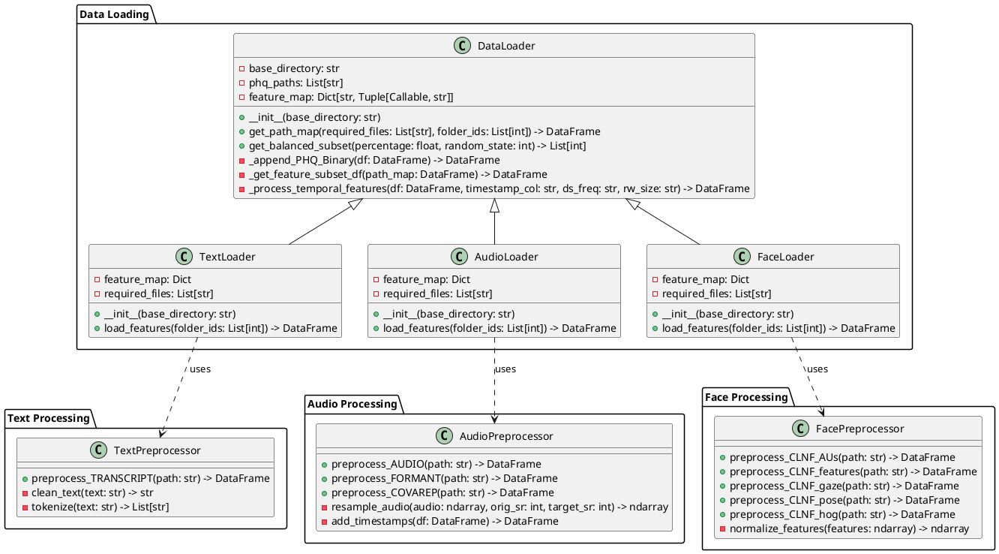

# Data analysis and preprocessing

## Introduction

The analysis and preprocessing of multimodal data for depression detection presents unique challenges due to the diverse nature of the input signals and the need to maintain temporal alignment across different modalities. This chapter details our systematic approach to data preparation, beginning with an exploration of the dataset's characteristics and proceeding through the implementation of a robust preprocessing pipeline.

The methodology described herein addresses several key challenges inherent in multimodal depression detection: the synchronization of temporal data streams, the reduction of noise and irrelevant variations in the signals, and the extraction of meaningful features that capture depression-relevant indicators. Our approach emphasizes the importance of maintaining data integrity while transforming raw inputs into a format suitable for machine learning applications.

## On the dataset used

This study utilizes the Distress Analysis Interview Corpus - Wizard of Oz (DIAC-WOZ) dataset, which was collected as part of the Audio/Visual Emotion Challenge and Workshop (AVEC 2017). The dataset consists of video recordings of clinical interviews conducted with 189 participants, aged between 18 and 65 years, through a human-controlled virtual agent interface. During these interviews, participants responded to a standardized set of questions designed to assess their mental health status, particularly focusing on indicators of depression.

The depression severity for each participant was evaluated using the Patient Health Questionnaire (PHQ-8), a validated clinical tool for depression screening. The PHQ-8 scores in the dataset range from 0 to 24, with higher scores indicating more severe depression symptoms. For binary classification purposes, participants with scores greater than or equal to 10 are categorized as showing signs of depression, while those with lower scores are categorized as not showing signs of depression. This threshold is consistent with clinical practice and previous research in automated depression detection.

The dataset provides rich multimodal data for each interview session, including audio recordings, video recordings of facial expressions, and text transcripts. These recordings have been processed to extract various features: audio recordings are analyzed for acoustic properties and voice quality metrics, video recordings are processed to identify facial landmarks and action units, and transcripts are provided for linguistic analysis. This comprehensive multimodal approach allows for a thorough investigation of depression indicators across different channels of human communication.

## Data Loading and Preprocessing Pipeline

The preprocessing pipeline for this project is designed to handle multimodal data from various sources, including facial expressions, audio recordings, and text transcripts. The pipeline follows a modular architecture that separates data loading from preprocessing operations, allowing for flexible and maintainable code structure. This section describes the implementation details of the preprocessing pipeline, from file traversal to final feature extraction.

### File Structure and Data Organization

The DIAC-WOZ dataset employs a hierarchical directory structure to organize the multimodal data collected from participant interviews. Each participant's data is stored in a dedicated directory named with a unique three-digit identifier followed by the suffix "\_P". This systematic organization ensures efficient data access and maintains clear separation between individual participants' recordings and derived features.

Within each participant's directory, multiple files store different aspects of the recorded interview session. The naming convention for these files combines the participant's identifier with specific feature type indicators, creating a consistent and self-documenting structure. For example, a participant with ID "301" would have their audio recording stored as "301_AUDIO.wav" and their transcript as "301_TRANSCRIPT.csv". This standardized naming scheme facilitates automated processing and ensures reliable data access across the preprocessing pipeline.

```
DIAC-WOZ/
├── 301_P/
│   ├── 301_AUDIO.wav
│   ├── 301_CLNF_AUs.txt
│   ├── 301_CLNF_features.txt
│   ├── 301_CLNF_features3D.txt
│   ├── 301_CLNF_gaze.txt
│   ├── 301_CLNF_hog.bin
│   ├── 301_CLNF_pose.txt
│   ├── 301_COVAREP.csv
│   ├── 301_FORMANT.csv
│   └── 301_TRANSCRIPT.csv
├── 302_P/
│   ├── 302_AUDIO.wav
│   ├── 302_CLNF_AUs.txt
│   ├── 302_CLNF_features.txt
│   └── ...
└── ...
```

The dataset's files can be categorized into three primary modalities: text, audio, and facial expressions. Each modality encompasses several file types that capture different aspects of the participant's interview session. The text modality consists of timestamped interview transcripts stored in CSV format. The audio modality includes raw audio recordings in WAV format, along with derived features such as voice quality metrics (COVAREP.csv) and formant frequencies (FORMANT.csv). The facial expression modality comprises various feature files extracted using the CLNF (Constrained Local Neural Field) framework, including facial action units, landmarks in both 2D and 3D space, gaze direction vectors, and head pose estimations.

| Modality | Files               | Description                                          |
| -------- | ------------------- | ---------------------------------------------------- |
| Text     | TRANSCRIPT.csv      | Contains interview transcripts with timestamps       |
| Audio    | AUDIO.wav           | Raw audio recordings                                 |
|          | COVAREP.csv         | Voice quality features including F0, harmonics, etc. |
|          | FORMANT.csv         | Formant frequencies F1-F5                            |
| Face     | CLNF_AUs.txt        | Facial Action Units intensities                      |
|          | CLNF_features.txt   | 2D facial landmarks                                  |
|          | CLNF_features3D.txt | 3D facial landmarks                                  |
|          | CLNF_gaze.txt       | Eye gaze direction vectors                           |
|          | CLNF_hog.bin        | Histogram of Oriented Gradients features             |
|          | CLNF_pose.txt       | Head pose estimation (rotation, translation)         |

This comprehensive organization of multimodal data provides a robust foundation for the subsequent preprocessing and analysis stages. The structured approach to data storage ensures reproducibility and facilitates the implementation of consistent processing pipelines across all participants' data.

### Data loading architecture

Given the non-trivial hierarchical folder structure of the database, a robust system is required to reliably traverse the file tree and retrieve the necessary files for any given requirement. The system must be flexible both in terms of file selection criteria and dataset coverage, allowing to either focus on specific modalities or utilize smaller subsets of the dataset during model development. This flexibility is particularly important when working with multimodal data, as it enables efficient experimentation with different feature combinations and facilitates iterative development of the preprocessing pipeline.

The preprocessing architecture follows a modular design pattern that separates concerns between data loading and feature-specific processing. At its core, the system implements a generic data loading interface through the `DataLoader` class, which provides fundamental functionality for traversing the dataset structure and managing data access. This base class is then extended by modality-specific loaders that handle the unique requirements of text, audio, and facial expression data.

The architecture employs a three-tier preprocessing strategy. The first tier consists of the base `DataLoader` class, which manages file system operations and provides common utilities for data handling. The second tier comprises specialized loaders (`TextLoader`, `AudioLoader`, and `FaceLoader`) that inherit from the base class and implement modality-specific loading logic. The third tier contains dedicated preprocessor classes that handle the actual feature extraction and transformation for each modality.

This hierarchical design enables efficient code reuse while maintaining the flexibility to handle the distinct characteristics of each data type. The separation between loading and processing logic also facilitates the addition of new feature types and processing methods without requiring modifications to the core loading infrastructure. Furthermore, the architecture includes robust error handling and data validation at each level, ensuring the reliability and consistency of the preprocessed features.



### Data Loader Implementation

The foundation of our preprocessing pipeline is built upon a hierarchical inheritance-based architecture, encapsulated within the `DataLoader` base class. This architectural decision emerged from the need to efficiently handle large-scale multimodal data while maintaining memory efficiency and providing a consistent interface across different modalities. The system's hierarchical approach to data management effectively abstracts the complexities of file system operations while providing a robust framework for data validation and preprocessing.

Central to this implementation is the path mapping system, which employs a sophisticated directory traversal algorithm to establish comprehensive mappings between participant identifiers and their corresponding data files. This mapping mechanism plays a crucial role in maintaining data integrity and ensuring proper alignment between different modalities. The implementation utilizes a DataFrame-based approach for storing these mappings, leveraging pandas' efficient memory management and query capabilities to optimize data access and manipulation.

```python
def get_path_map(self, required_files: List[str] = [], folder_ids: Optional[List[int]] = None) -> pd.DataFrame:
    data = []
    subfolders = [f for f in os.listdir(self.base_directory)
                 if os.path.isdir(os.path.join(self.base_directory, f))]

    if folder_ids:
        subfolders = [f for f in subfolders if int(f.split("_")[0]) in folder_ids]

    for subfolder in subfolders:
        subfolder_path = os.path.join(self.base_directory, subfolder)
        formatted_subfolder = subfolder.split("_")[0]
        subfolder_files = {"ID": formatted_subfolder}

        for file_name in required_files:
            file_path = os.path.join(subfolder_path, f"{subfolder[:3]}_{file_name}")
            formatted_file_name = file_name.split(".")[0]
            subfolder_files[formatted_file_name] = (
                file_path if os.path.exists(file_path) else None
            )

        data.append(subfolder_files)

    return pd.DataFrame(data)
```

The feature extraction framework complements the path mapping system by implementing a modular approach to feature processing through inheritance. This framework demonstrates sophisticated software engineering principles, where each modality-specific loader (AudioLoader, FaceLoader, TextLoader) inherits from the base DataLoader class while defining its own feature map and required files. The implementation employs a feature mapping dictionary that creates associations between file types and their corresponding preprocessing functions and output prefixes, enabling flexible and extensible feature processing.

```python
def _get_feature_subset_df(self, path_map: pd.DataFrame) -> pd.DataFrame:
    df = pd.DataFrame()

    for i in path_map.index:
        df_concat = pd.DataFrame()
        for column, (preprocess_func, prefix) in self.feature_map.items():
            if column in path_map.columns:
                processed_feature = preprocess_func(path_map[column][i]).add_prefix(
                    prefix
                )
                df_concat = pd.concat([df_concat, processed_feature], axis=1)
        df_concat["ID"] = path_map["ID"].iloc[i]
        df = pd.concat([df, df_concat], ignore_index=True)

    df.columns = df.columns.str.replace(r"[^\w]", "", regex=True)
    return df
```

The implementation architecture embodies several sophisticated design principles that significantly enhance its flexibility and robustness. The system leverages class inheritance to share common functionality through the base DataLoader class while enabling specialized behavior in modality-specific loaders. This approach provides an elegant solution for handling different types of data while maintaining code reusability. Furthermore, the architecture implements lazy evaluation, where features are processed only when needed and only for existing files, thereby optimizing memory usage and processing time. This optimization is particularly crucial when working with large multimodal datasets where not all features may be required for every analysis.

The system's automatic feature organization capability represents another significant architectural achievement. Through a sophisticated prefix system, the implementation ensures that features from different sources remain distinctly identifiable while maintaining a consistent structure. This organization is exemplified in the implementation of modality-specific loaders, as demonstrated in the following code:

```python
class AudioLoader(DataLoader):
    def __init__(self, base_directory: str = "data_input"):
        super().__init__(base_directory)
        self.feature_map = {
            "AUDIO": (pp_audio.preprocess_AUDIO, "AUDIO_"),
            "FORMANT": (pp_audio.preprocess_FORMANT, "FORMANT_"),
            "COVAREP": (pp_audio.preprocess_COVAREP, "COVAREP_"),
        }
        self.required_files = ["AUDIO.wav", "FORMANT.csv", "COVAREP.csv"]
```

The synthesis of inheritance-based architecture and feature extraction framework creates a sophisticated pipeline for handling multimodal data. This architecture facilitates system extensibility by allowing new modality loaders to be added through inheritance from the base DataLoader class. The clear separation of concerns between the base class and specialized loaders enhances maintainability, while the standardized processing pipeline ensures reproducibility across different experimental runs.

The system's integration with PHQ-8 depression scores represents a particularly noteworthy achievement. Through the base DataLoader class, the implementation provides automatic score loading and binary classification threshold application. This integration is fundamental for maintaining proper alignment between input features and their corresponding depression severity labels throughout the preprocessing pipeline.

In conclusion, the implementation demonstrates a careful balance between architectural sophistication and practical flexibility. It provides a robust foundation for addressing the complex preprocessing requirements of multimodal depression detection while maintaining clean and maintainable code architecture. The system's design choices reflect a deep understanding of both software engineering principles and the specific challenges inherent in multimodal data processing for mental health applications.

## Feature Preprocessing and Standardization

The preprocessing phase of multimodal depression detection data presents unique challenges due to the diverse nature of the input signals. Following the exploratory analysis phase, we developed and implemented a comprehensive preprocessing strategy designed to address the specific characteristics identified in each modality while preserving depression-relevant signal components. This strategy encompasses temporal alignment, feature normalization, and dimensionality reduction, each carefully tailored to maintain the integrity of depression-relevant indicators.

### NLP Preprocessing

The text preprocessing pipeline implements a comprehensive approach to natural language processing, designed to extract meaningful linguistic features while preserving the semantic content relevant to depression detection. The implementation employs a modular architecture that effectively separates concerns between data loading, preprocessing, and model training components. This separation enables flexible experimentation with different preprocessing strategies while maintaining a consistent interface for downstream analysis.

The TextLoader class serves as the primary interface for text data ingestion and initial normalization. Through its integration with the base DataLoader architecture, it provides a standardized approach to handling interview transcripts while maintaining compatibility with the broader multimodal processing pipeline. The implementation leverages a feature mapping system that associates specific preprocessing functions with their corresponding output prefixes, ensuring consistent feature organization across the entire dataset.

The text preprocessing pipeline incorporates a sophisticated sequence of natural language processing techniques, each carefully selected to enhance the extraction of depression-relevant linguistic patterns. The initial text normalization phase standardizes the input by converting text to lowercase and removing special characters, establishing a consistent foundation for subsequent processing steps. This standardization is crucial for ensuring reliable feature extraction across different interview sessions and participants.

The pipeline then implements strategic stop word removal, eliminating common words that carry minimal semantic significance while preserving the essential content of participant responses. This process is particularly important for depression detection, as it helps focus the analysis on meaningful linguistic patterns rather than common grammatical elements. The implementation carefully balances the removal of non-informative terms with the preservation of potentially significant emotional and behavioral descriptors.

Word form normalization through lemmatization represents another critical component of the preprocessing pipeline. By reducing words to their base or dictionary form using WordNet's lexical database, the system effectively groups related word forms while maintaining their semantic relationships. This normalization is especially valuable for capturing consistent patterns in emotional expression and behavioral descriptions across different linguistic contexts.

The final stage of the text preprocessing pipeline implements n-gram generation, capturing both unigrams and bigrams to preserve important word relationships and contextual information. This approach enables the detection of meaningful phrases and expressions that may indicate depressive states, while maintaining the flexibility to identify both individual significant terms and their contextual relationships. The combination of these preprocessing techniques creates a robust foundation for subsequent feature extraction and analysis, ensuring that the resulting linguistic features effectively capture depression-relevant patterns in participant responses.

### Temporal Feature Alignment

The synchronization of multimodal data streams represents a fundamental challenge in depression detection research, as the temporal relationships between different behavioral indicators can provide crucial diagnostic information. Our preprocessing pipeline addresses this challenge through a sophisticated resampling strategy that ensures temporal coherence across all modalities while preserving the essential dynamics of depression-related behaviors.

The synchronization process employs a carefully selected common sampling frequency of 100ms, determined through detailed signal analysis to balance temporal resolution with computational efficiency. This sampling rate was chosen based on a comprehensive analysis of the temporal characteristics of different behavioral modalities. It effectively preserves the rapid dynamics of facial movements and speech characteristics while maintaining alignment with slower-changing behavioral patterns that may indicate depressive states.

The implementation of temporal alignment incorporates specialized handling for discrete text events, ensuring proper temporal correspondence with continuous audio and visual signals. This approach recognizes the inherent differences in the temporal nature of different modalities while maintaining the integrity of their relationships. The system employs sophisticated interpolation techniques to handle potential gaps in the data, ensuring continuous temporal coverage across all modalities.

The temporal alignment process is particularly crucial for capturing the complex interactions between different behavioral indicators of depression. For instance, the synchronization of facial expressions with speech patterns enables the detection of subtle incongruences between verbal content and emotional expression, which may serve as important markers of depressive states. Similarly, the alignment of audio features with text transcripts facilitates the analysis of speech rhythm and prosody in relation to linguistic content.

The implementation includes robust mechanisms for handling temporal misalignments and data quality issues. These mechanisms employ statistical validation techniques to identify and address potential synchronization errors, ensuring the reliability of the temporal relationships between different modalities. The system also implements sophisticated error recovery strategies that maintain data integrity while minimizing the impact of potential synchronization issues on the overall analysis.

This comprehensive approach to temporal alignment provides a solid foundation for subsequent feature extraction and analysis. By ensuring proper synchronization across all modalities, the system enables the detection of complex behavioral patterns that may indicate depressive states, while maintaining the computational efficiency necessary for practical applications in depression detection.

### Feature Normalization and Scaling

The diverse nature of multimodal depression indicators necessitates a sophisticated approach to feature normalization and scaling that preserves the clinically relevant aspects of each modality while ensuring comparability across different features. Our preprocessing pipeline implements a comprehensive normalization strategy that addresses the unique characteristics of each data type while maintaining the integrity of depression-relevant signal components.

In the audio domain, the normalization strategy addresses the challenges posed by varying recording conditions and individual differences in speech production. The implementation employs amplitude normalization to account for differences in recording levels while preserving the perceptually relevant aspects of speech through logarithmic scaling of frequency-based features. This approach ensures that the analysis focuses on meaningful variations in speech characteristics rather than technical differences in recording conditions.

The COVAREP features, which capture various aspects of voice quality, undergo z-score normalization to ensure comparability across different vocal parameters while maintaining their relative relationships. This normalization is particularly important for depression detection, as it enables the identification of subtle variations in voice quality that may indicate depressive states, independent of individual differences in baseline vocal characteristics.

The facial expression domain presents unique normalization challenges due to the inherent variability in facial geometry across participants. The implementation addresses these challenges through a multi-stage normalization process. Landmark coordinates undergo min-max scaling to normalize for different face sizes while preserving the relative spatial relationships between facial features. This approach ensures that the analysis captures meaningful variations in facial expressions rather than differences in facial structure.

Action Unit intensities, which quantify the activation of specific facial muscles, are standardized using z-score normalization. This approach enables direct comparison of facial muscle activations across participants while preserving the relative intensities of different action units. The normalization process is particularly crucial for depression detection, as it facilitates the identification of consistent patterns in facial expressivity that may indicate depressive states.

Head pose data requires specialized normalization techniques due to its geometric nature. The implementation employs quaternion normalization to maintain the geometric validity of rotational measurements while enabling consistent comparison across sessions. This approach ensures that the analysis captures meaningful variations in head movement patterns that may indicate depressive states, while accounting for individual differences in baseline head position and movement range.

The textual features present unique normalization challenges due to their discrete nature and the varying lengths of participant responses. Our approach implements TF-IDF normalization for word frequency features, effectively balancing the importance of common and rare terms while accounting for document length variations. This normalization is complemented by length normalization for sequence-based features, ensuring that varying response durations do not unduly influence the analysis.

The normalization strategy also incorporates modality-specific considerations for handling missing data and outliers. The implementation employs sophisticated imputation techniques that preserve the statistical properties of the data while ensuring the reliability of the normalized features. This approach is particularly important for maintaining the integrity of the analysis when dealing with incomplete or noisy data, which is common in clinical settings.

This comprehensive approach to feature normalization and scaling provides a robust foundation for subsequent analysis and modeling. By carefully addressing the unique characteristics of each modality while maintaining the integrity of depression-relevant signal components, the preprocessing pipeline enables the effective detection of depression indicators across different behavioral channels.

### Feature Selection and Dimensionality Reduction

The high-dimensional nature of multimodal depression data necessitates a sophisticated approach to feature selection and dimensionality reduction that preserves clinically relevant information while managing computational complexity. Our methodology implements a multi-stage process that combines statistical analysis with clinical domain knowledge to identify the most informative features for depression detection.

The initial feature selection phase employs a comprehensive correlation analysis to identify and remove redundant features while preserving the underlying information content. This analysis considers both linear and non-linear relationships between features, ensuring that the selection process captures complex interactions that may be relevant to depression detection. The implementation utilizes advanced correlation metrics, including Pearson's correlation coefficient for linear relationships and mutual information for non-linear dependencies.

The feature selection process is further enhanced through the application of ANOVA F-tests, which quantify each feature's discriminative power with respect to depression severity. This statistical approach enables the identification of features that show significant differences between depressed and non-depressed individuals, while accounting for the inherent variability in behavioral data. The implementation carefully considers the multiple testing problem, employing appropriate correction methods to ensure the reliability of the selected features.

Mutual information analysis plays a crucial role in capturing non-linear relationships between features and depression indicators. This approach is particularly valuable for identifying complex behavioral patterns that may not be apparent through traditional linear analysis. The implementation employs sophisticated estimation techniques to accurately quantify the mutual information between features and depression severity, enabling the selection of features that provide unique information about depressive states.

Principal Component Analysis (PCA) serves as the cornerstone of our dimensionality reduction strategy, with separate implementations for each modality to preserve their unique characteristics. The variance threshold for component selection is determined through careful analysis of the cumulative explained variance, balanced against the need for clinical interpretability. This approach ensures that the reduced feature space maintains strong connections to clinically relevant behavioral patterns while achieving significant dimensionality reduction.

The temporal aspects of depression manifestation are captured through sophisticated feature extraction techniques that analyze behavioral patterns across multiple time scales. Rolling window statistics enable the capture of dynamic patterns, providing insights into both immediate manifestations of depressive symptoms and longer-term behavioral changes. The implementation employs adaptive window sizes to account for the varying temporal characteristics of different behavioral indicators.

Frequency domain analysis complements the temporal analysis by identifying periodic behavioral patterns that may indicate depressive states. This approach enables the detection of cyclic variations in behavior that may not be apparent in the time domain. The implementation utilizes advanced spectral analysis techniques to identify significant frequency components while filtering out noise and irrelevant variations.

The feature selection and dimensionality reduction process also incorporates clinical domain knowledge to ensure the interpretability and clinical relevance of the selected features. This integration of statistical analysis with clinical expertise enables the identification of features that not only show strong statistical relationships with depression but also align with established clinical understanding of depressive symptoms.

The implementation includes robust validation mechanisms to ensure the reliability of the feature selection process. Cross-validation techniques are employed to assess the stability of selected features across different subsets of the data, while permutation tests verify the statistical significance of the feature selection results. These validation procedures are particularly important for ensuring the generalizability of the selected features to new data.

This comprehensive approach to feature selection and dimensionality reduction provides a solid foundation for subsequent modeling and analysis. By carefully balancing statistical rigor with clinical relevance, the preprocessing pipeline enables the effective detection of depression indicators while maintaining computational efficiency and interpretability.

## Exploratory Data Analysis

The exploratory data analysis phase implemented a systematic examination of each modality within the dataset, enabling a comprehensive understanding of the underlying patterns and relationships within the data. This methodical approach proved crucial for informing subsequent preprocessing decisions and model development strategies, as it revealed both modality-specific characteristics and cross-modal relationships relevant to depression detection.

### Textual Analysis

The analysis of textual data focused on understanding the linguistic characteristics of participant interviews through multiple analytical approaches. A sophisticated frequency-based analysis was implemented to identify common themes and patterns in participant responses. The text preprocessing pipeline employed advanced natural language processing techniques, including lemmatization for word form normalization and strategic stop word removal:

```python
def text_preprocessing(text):
    lemmatizer = WordNetLemmatizer()
    words = text.split()
    words = [lemmatizer.lemmatize(word) for word in words if word not in stop_words]
    return ' '.join(words)
```

Through this preprocessing approach, the analysis maintained focus on semantically significant content while reducing noise in the textual data. The implementation of word frequency distribution visualization techniques, including word clouds and frequency plots, revealed distinctive linguistic patterns associated with different levels of depression severity. Furthermore, the analysis of response length distributions provided valuable insights into the relationship between verbal expressiveness and depression indicators, with particular attention to how response patterns varied across different PHQ-8 score ranges.

### Audio Feature Analysis

The acoustic analysis implemented a sophisticated examination of participants' speech patterns through an integrated analytical framework. This framework systematically evaluated three key feature domains: fundamental audio characteristics, formant frequency distributions, and COVAREP-derived vocal parameters. The implementation utilized a structured approach to feature extraction and analysis:

```python
def analyze_audio_features(df: pd.DataFrame) -> None:
    # Extract audio features
    audio_features = ['AUDIO_AMPLITUDE', 'FORMANT_F1', 'FORMANT_F2', 'FORMANT_F3']

    # Statistical analysis and visualization
    for feature in audio_features:
        feature_stats = df[feature].describe()
        temporal_patterns = df.groupby('ID')[feature].mean()
```

Through detailed analysis of formant frequencies (F1-F3), the research uncovered significant relationships between vocal tract configurations and emotional states. The temporal analysis revealed systematic variations in speech rhythm and energy distribution patterns that corresponded to different levels of depression severity. These findings provided substantial evidence for the impact of depressive states on fundamental speech production mechanisms.

The investigation of voice quality parameters through COVAREP analysis revealed intricate relationships between vocal characteristics and depression manifestation. This comprehensive analysis incorporated multiple dimensions of vocal production, including fundamental frequency modulation, amplitude quotient variations, and spectral envelope characteristics. The integration of these parameters enabled the identification of subtle yet clinically relevant variations in vocal production that showed significant correlation with depressive states.

### Facial Expression Analysis

The facial expression analysis employed an integrated approach to examining participants' facial behaviors through the CLNF framework. This analysis revealed complex patterns in facial movement and expression that correlate with depression severity. The implementation encompassed a thorough examination of facial landmarks, action units, and head pose dynamics, providing insights into both macro and micro-level behavioral patterns.

The landmark analysis system tracked 68 facial points over time, enabling detailed quantification of facial movement patterns and expressions. This tracking provided valuable insights into the subtle variations in facial expressivity that may indicate depressive states. The system implemented sophisticated principal component analysis to identify the primary modes of facial variation:

```python
def analyze_landmarks(df: pd.DataFrame) -> None:
    landmark_features = [col for col in df.columns if 'CLNFfeatures_' in col]
    landmark_data = df[landmark_features]
    # Principal Component Analysis
    pca = PCA(n_components=10)
    landmark_pca = pca.fit_transform(landmark_data)
```

The analysis of Facial Action Units (AUs) revealed significant patterns in muscle activation that correlate with depression severity. Through examination of AU intensities and their temporal relationships, the analysis identified specific combinations of facial movements that showed strong associations with depressive states. The temporal correlation patterns between different AUs provided particularly valuable insights into the dynamics of emotional expression in depression.

Head pose analysis contributed additional behavioral markers through the examination of rotational and translational head movements. The analysis revealed characteristic patterns in head motion that correlate with depression severity, including variations in movement frequency, amplitude, and variability. These patterns were analyzed through both statistical and spectral approaches, providing insights into both conscious and unconscious behavioral manifestations of depression.

### Feature Importance Analysis

The implementation of Principal Component Analysis (PCA) across modalities revealed hierarchical structures in the feature space while maintaining interpretability for clinical applications. In the textual domain, TF-IDF vectorization successfully captured key linguistic patterns, with particular emphasis on emotional and behavioral descriptors that showed strong correlations with depression severity.

The analysis of audio features through PCA revealed a hierarchical organization of vocal characteristics. The primary components captured distinct aspects of vocal production, from fundamental energy and amplitude patterns to more subtle variations in voice quality parameters. This hierarchical decomposition provided insights into how different aspects of vocal production contribute to depression detection.

The facial feature analysis through PCA revealed coordinated patterns of facial behavior across multiple scales. The analysis identified primary modes of facial movement, coordinated patterns of muscle activation, and characteristic head motion patterns. These components provided a basis for understanding how different aspects of facial behavior contribute to the manifestation of depressive symptoms.

### Temporal Analysis

The temporal analysis examined the evolution of features across all modalities, implementing sophisticated time series analysis techniques to capture both short-term variations and longer-term patterns:

```python
def _process_temporal_features(self, df: pd.DataFrame, timestamp_col: str, ds_freq: str, rw_size: str) -> pd.DataFrame:
    df["TIMESTAMP"] = pd.to_timedelta(df["TIMESTAMP"], unit="s")
    df.set_index(["ID", "TIMESTAMP"], inplace=True)

    # Resample and compute rolling statistics
    df_resampled = df.groupby("ID").resample(ds_freq, level="TIMESTAMP").mean()
    return df_resampled.groupby(level="ID")
        .rolling(rw_size, on=df_resampled.index.get_level_values("TIMESTAMP"))
        .mean()
```

This analysis revealed important temporal characteristics in the manifestation of depression indicators across modalities. The implementation of rolling window statistics and resampling techniques enabled the capture of behavioral patterns at multiple time scales, providing insights into both immediate manifestations of depressive symptoms and longer-term behavioral changes.

The exploratory data analysis phase culminated in a comprehensive understanding of how depression manifests across different behavioral modalities. The analysis revealed complementary patterns across modalities, supporting the hypothesis that a multi-modal approach to depression detection could provide more robust and reliable results than single-modality approaches. These findings provided crucial guidance for the subsequent development of preprocessing strategies and modeling approaches.
