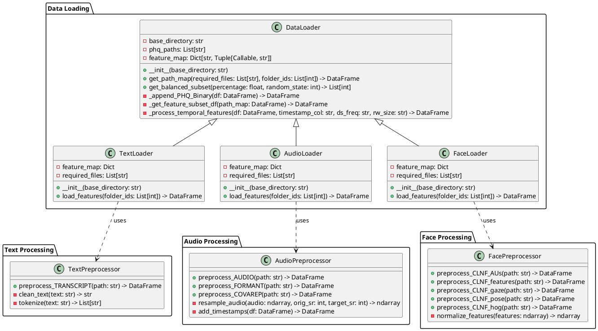

# Data analysis and preprocessing

## Introduction

The analysis and preprocessing of multimodal data for mental health classification presents a challenge due to the diverse nature of the input signals and the need to maintain temporal alignment across different modalities. This chapter details approach used for data preparation, beginning with an exploration of the dataset's characteristics and proceeding through the implementation of the preprocessing pipeline.

The methodology described in this chapter addresses several key challenges inherent in multimodal mental health classification: the synchronization of temporal data streams, the reduction of noise and irrelevant variations in the signals, and the extraction of meaningful features that capture depression-relevant indicators.

## On the dataset used

This study utilizes the Distress Analysis Interview Corpus - Wizard of Oz (DIAC-WOZ) dataset, which was collected as part of the Audio/Visual Emotion Challenge and Workshop (AVEC 2017). The dataset consists of video recordings of clinical interviews conducted with 189 participants, aged between 18 and 65 years, through a human-controlled virtual agent interface. During these interviews, participants responded to a standardized set of questions designed to assess their mental health status, particularly focusing on indicators of depression.

The depression severity for each participant was evaluated using the Patient Health Questionnaire (PHQ-8), a widely used clinical tool for depression screening. The PHQ-8 scores in the dataset range from 0 to 24, with higher scores indicating more severe depression symptoms. For binary classification purposes, participants with scores greater than or equal to 10 are categorized as showing signs of depression, while those with lower scores are categorized as not showing signs of depression. This threshold is consistent with clinical practice and previous research in automated depression detection.

The dataset provides multimodal data for each interview session, including audio recordings, video recordings of facial expressions, and text transcripts. These recordings have been processed to extract various features: audio recordings are analyzed for acoustic properties and voice quality metrics, video recordings are processed to identify facial landmarks and action units, and textual transcripts are provided in plain text format for linguistic analysis. The multimodal nature of the datased aims to provide more rich contextual information that is inacsesable in a traditional questionarre format.

## Data Loading and Preprocessing Pipeline

A dedicated preprocessing pipeline was essential for this project due to the multimodal nature of the DIAC-WOZ dataset. In practical terms, most analytical and modeling tasks focus on a specific modality—such as text, audio, or facial expressions—rather than the entire dataset simultaneously. For instance, when developing and training models for the textual modality, only the files and features relevant to text analysis are required, while data from the audio and facial modalities can be disregarded. Furthermore, the presence of two time series modalities—audio and facial expressions—introduces additional challenges related to differing sampling rates and temporal alignment. By implementing a systematic preprocessing pipeline, the project ensures that modality-specific data can be correctly processed, while also providing robust solutions for harmonizing temporal features across modalities.

The pipeline follows a modular architecture that separates data loading from preprocessing operations, following clean code design principles. This section describes the implementation details of the preprocessing pipeline, from file traversal to final feature extraction.

### File Structure and Data Organization

The DIAC-WOZ dataset uses a hierarchical directory structure to organize the multimodal data collected from participant interviews. Each participant's data is stored in a dedicated directory named with a unique three-digit identifier followed by the suffix "\_P".

Within each participant's directory, multiple files store different features of the recorded interview session. The naming convention for these files combines the participant's identifier with specific feature type indicators. For example, a participant with ID "301" would have their audio recording stored as "301_AUDIO.wav" and their transcript as "301_TRANSCRIPT.csv". Each participants directory contains all of the data collected for each modality.

```
DIAC-WOZ/
├── 301_P/
│   ├── 301_AUDIO.wav
│   ├── 301_CLNF_AUs.txt
│   ├── 301_CLNF_features.txt
│   ├── 301_CLNF_features3D.txt
│   ├── 301_CLNF_gaze.txt
│   ├── 301_CLNF_hog.bin
│   ├── 301_CLNF_pose.txt
│   ├── 301_COVAREP.csv
│   ├── 301_FORMANT.csv
│   └── 301_TRANSCRIPT.csv
├── 302_P/
│   ├── 302_AUDIO.wav
│   ├── 302_CLNF_AUs.txt
│   ├── 302_CLNF_features.txt
│   └── ...
└── ...
```

The dataset's files can be categorized into three primary modalities: text, audio, and facial expressions. The modalities are mostly split up into multiple files with wach file representing a single feature of the modality with the exception of the extual modality that only has one file.
The text modality consists of timestamped interview transcripts stored in CSV format. The audio modality includes raw audio recordings in WAV format, along with derived features such as voice quality metrics (COVAREP.csv) and formant frequencies (FORMANT.csv). The facial expression modality comprises various feature files extracted using the CLNF (Constrained Local Neural Field) framework, including facial action units, landmarks in both 2D and 3D space, gaze direction vectors, and head pose estimations.

| Modality | Files               | Description                                          |
| -------- | ------------------- | ---------------------------------------------------- |
| Text     | TRANSCRIPT.csv      | Contains interview transcripts with timestamps       |
| Audio    | AUDIO.wav           | Raw audio recordings                                 |
|          | COVAREP.csv         | Voice quality features including F0, harmonics, etc. |
|          | FORMANT.csv         | Formant frequencies F1-F5                            |
| Face     | CLNF_AUs.txt        | Facial Action Units intensities                      |
|          | CLNF_features.txt   | 2D facial landmarks                                  |
|          | CLNF_features3D.txt | 3D facial landmarks                                  |
|          | CLNF_gaze.txt       | Eye gaze direction vectors                           |
|          | CLNF_hog.bin        | Histogram of Oriented Gradients features             |
|          | CLNF_pose.txt       | Head pose estimation (rotation, translation)         |

This organization of features makes it simple to retrieve information about a single participant, whether for all modalities or for a specific modality of interest. However, when the analysis requires data from a group of participants, particularly across a single modality, the process becomes more convoluted, needing traversal and searching of the file tree to locate and aggregate the relevant files.
To simplify the data aggredation process, data loading was abstracted into a dedicated part of the preprocessing pipeline

### Data loader architecture

The preprocessing and data loading system was designed to be flexible both in terms of file selection criteria and dataset coverage. It enables both selecting for specific modalities as well as retrieving any size subset when loading data, simplifying the preprocessing process and enabling faster model development on smaller subsets.
Once data loading is complete, the system automatically applies the predefined preprocessing procedures for each file type present in the dataset. This ensures that, regardless of the modality or subset selected, all relevant files undergo consistent and modality appropriate preprocessing.

The preprocessing architecture uses a generic data loading interface through the DataLoader class, which provides fundamental functionality for traversing the dataset structure and managing data access.
This base class is then extended by modality-specific loaders (TextLoader, AudioLoader, and FaceLoader) that handle the unique requirements of each modality.
Finally the actual preprocessing workflow in each of the modality specific loaders is handled by dedicated preprocessor classes for each file type of the modality. These classes handle the actual feature extraction and transformation.

This hierarchical design enables efficient code reuse while maintaining the flexibility to handle the distinct characteristics of each data type. The separation between loading and processing logic also simplifies the addition of new feature types and processing methods.



### Data Loader Implementation

As the main abstract class within the preprocessing pipeline, the DataLoader class is responsible for managing file system traversal and the retrieval of relevant data files from the hierarchical dataset structure.
Its primary function is to abstract the complexities associated with navigating the filetree as well as offer utility functions for common tasks such as getting a balanced subset of the dataset of a specific size or functionality for iterating through the retreived files for simpler preprocessing down the line.

Central to this implementation is the path mapping system, which uses a directory traversal algorithm to establish mappings between participant identifiers and their corresponding data files.

For example when the get_path_map() function is called with the required files `["AUDIO.wav", "COVAREP.csv", "FORMANT.csv"]` and the folder IDs `["300", "301", "302"]`, the mapping system traverses the dataset directory, searching only within the specified participant folders. For each folder, it attempts to locate the requested files, constructing a mapping between participant IDs and the absolute paths to each required file. If a file is missing for a participant, the corresponding entry is set to `None`. The result is a DataFrame that provides a clear overview of which files are available for each participant and where they are located.

When executed, the resulting mapping table might look something like this:

| ID  | AUDIO                  | COVAREP                  | FORMANT                  |
| --- | ---------------------- | ------------------------ | ------------------------ |
| 300 | path/to/300_AUDIO.wav  | path/to/300_COVAREP.csv  | path/to/300_FORMANT.csv  |
| 301 | path/to/3001_AUDIO.wav | None                     | path/to/3001_FORMANT.csv |
| 302 | None                   | path/to/3002_COVAREP.csv | None                     |

This table allows downstream processes to easily identify which files are present for each participant and to handle missing data appropriately, as well as greatly simplify any iterations through the required files.

```python
def get_path_map(self, required_files: List[str] = [], folder_ids: Optional[List[int]] = None) -> pd.DataFrame:
    data = []
    subfolders = [f for f in os.listdir(self.base_directory)
                 if os.path.isdir(os.path.join(self.base_directory, f))]

    if folder_ids:
        subfolders = [f for f in subfolders if int(f.split("_")[0]) in folder_ids]

    for subfolder in subfolders:
        subfolder_path = os.path.join(self.base_directory, subfolder)
        formatted_subfolder = subfolder.split("_")[0]
        subfolder_files = {"ID": formatted_subfolder}

        for file_name in required_files:
            file_path = os.path.join(subfolder_path, f"{subfolder[:3]}_{file_name}")
            formatted_file_name = file_name.split(".")[0]
            subfolder_files[formatted_file_name] = (
                file_path if os.path.exists(file_path) else None
            )

        data.append(subfolder_files)

    return pd.DataFrame(data)
```

The get_feature_subset_df() method complements the path mapping system by implementing a modular approach to feature processing through inheritance. This allows each modality-specific loader (AudioLoader, FaceLoader, TextLoader) to inherit from the base DataLoader class while still defining its own feature map and required files. The implementation employs a feature mapping dictionary that creates associations between file types and their corresponding preprocessing functions and output prefixes for flexible and extensible feature processing.

```python
def _get_feature_subset_df(self, path_map: pd.DataFrame) -> pd.DataFrame:
    df = pd.DataFrame()

    for i in path_map.index:
        df_concat = pd.DataFrame()
        for column, (preprocess_func, prefix) in self.feature_map.items():
            if column in path_map.columns:
                processed_feature = preprocess_func(path_map[column][i]).add_prefix(
                    prefix
                )
                df_concat = pd.concat([df_concat, processed_feature], axis=1)
        df_concat["ID"] = path_map["ID"].iloc[i]
        df = pd.concat([df, df_concat], ignore_index=True)

    df.columns = df.columns.str.replace(r"[^\w]", "", regex=True)
    return df
```

The system's automatic feature organization capability represents another significant architectural achievement. Each modality-specific loader—such as the AudioLoader, FaceLoader, and TextLoader—leverages the modularity of the base DataLoader by defining its own feature map and required files tailored to the characteristics of its modality. These loaders utilize the get_feature_subset_df() method to systematically process only the relevant files, applying the appropriate preprocessing functions as specified in their feature maps. For example, the AudioLoader class specifies a feature map that associates each audio-related file type (such as AUDIO, FORMANT, and COVAREP) with its corresponding preprocessing function and output prefix, and lists the required files for audio analysis. This design ensures that features from different sources remain distinctly identifiable and consistently structured, while also enabling extensibility for future modalities or feature types. By encapsulating modality-specific logic within dedicated loaders and centralizing feature extraction through a unified interface, the system achieves both organizational clarity and robust scalability.

```python
class AudioLoader(DataLoader):
    def __init__(self, base_directory: str = "data_input"):
        super().__init__(base_directory)
        self.feature_map = {
            "AUDIO": (pp_audio.preprocess_AUDIO, "AUDIO_"),
            "FORMANT": (pp_audio.preprocess_FORMANT, "FORMANT_"),
            "COVAREP": (pp_audio.preprocess_COVAREP, "COVAREP_"),
        }
        self.required_files = ["AUDIO.wav", "FORMANT.csv", "COVAREP.csv"]
```

The system also handles dealing with PHQ-8 scores. Through the base DataLoader class the implementation provides automatic score loading, witch is not only used for retreiving results data but also for finding balanced subsets of the dataset, allowing smoother developement of the mdoels and training pipline later on in the developement process.

In summary, the DataLoader implementation simplifies the data preprocessing workflow in a fexible and extensible manner. By leveraging an inheritance-based architecture, the system allows for integration of new modality loaders while maintaining a clear separation of concerns between the base class and specialized loaders. The standardized processing pipeline ensures consistent handling of multimodal data and reliable alignment between input features and PHQ-8 depression scores.

### Feature Preprocessing and Standardization

Following the implementation of the abstract DataLoader and its modality-specific extensions, the next stage in the preprocessing pipeline involves the use of dedicated preprocessor modules for each modality. These preprocessors are organized into three separate files, one each for text, audio, and facial data, and are responsible for handling the preprocessing of all file types associated with their respective modalities. Each preprocessor module contains specialized methods for processing the various data formats present in the dataset, as well as any necessary supporting utility functions. The following section details the most significant preprocessing steps employed for each modality, highlighting the strategies used to ensure the integrity and relevance of the extracted features.

#### NLP Preprocessing

The text preprocessing pipeline implements a comprehensive approach to natural language processing, designed to extract meaningful linguistic features while preserving the semantic content relevant to depression detection.

The NLP pipline, like all other preprocessing pipelines in this project, starts with the Loader class in this case specefically the TextLoader class. It handles all of the basic file retreival and basic preprocessing tasks, providing the pipeline with a starting dafarame to work off.

After the Loader class has done its job, the text preprocessing pipeline applies a sequence of natural language processing techniques. The initial text normalization phase standardizes the input by converting text to lowercase and removing special characters, establishing a consistent foundation for subsequent processing steps. This standardization ensures reliable feature extraction across different interview sessions and participants.

The pipeline then implements strategic stop word removal, eliminating common words that carry minimal semantic significance while preserving the essential content of participant responses. This process is particularly important for depression detection, as it helps focus the analysis on meaningful linguistic patterns rather than common grammatical elements.

Word form normalization through lemmatization represents another critical component of the preprocessing pipeline. By reducing words to their base or dictionary form using WordNet's lexical database, the system effectively groups related word forms while maintaining their semantic relationships. This normalization is especially valuable for capturing consistent patterns in emotional expression and behavioral descriptions across different linguistic contexts.

The final stage of the text preprocessing pipeline implements n-gram generation, capturing both unigrams and bigrams to preserve important word relationships and contextual information. This approach enables the detection of meaningful phrases and expressions that may indicate depressive states, while maintaining the flexibility to identify both individual significant terms and their contextual relationships.

The combination of these preprocessing techniques ensures that the resulting linguistic features effectively capture depression-relevant patterns in participant responses.

#### Temporal Feature Alignment

Since two of the three modalities in this dataset are represented by time series data, it is crutial to correctly handle the temporal nature of these modalities and avoid any issues that may arrise.

In the AudioLoader and FaceLoader classes, the resulting datasets are double indexed; one index being the participant ID and the other index being the timestamp. This ensures that later on the moels have acces to the temporal relationships between different behavioral indicators, witch can provide crucial information for classification

Given the tools available for collecting data of these two modalities (audio data being collected via a microphone and facial data via a camera) the two modalities are collected using two different sampling rates. This will be a problem later on when combining the two modalities using multimodal fusion so the two modalities need to be aligned temporally.

To ensure consistancy and simplicity the temporal allingment is done as part of the preprocessing steps in the AudioLoader and FaceLoader classes through a resampling strategy that ensures temporal coherence across all modalities while preserving the essential dynamics of depression-related behaviors.

The synchronization process employs a common sampling frequency of 100ms, determined through signal analysis to balance temporal resolution with computational efficiency. It preserves the rapid dynamics of facial movements and speech characteristics while maintaining alignment with slower-changing behavioral patterns that may indicate depressive states.

The system employs interpolation techniques to handle potential gaps in the data, ensuring continuous temporal coverage across all modalities.

The temporal alignment process is particularly crucial for capturing the complex interactions between different behavioral indicators of depression. For instance, the synchronization of facial expressions with speech patterns enables the detection of subtle inconsistancies between verbal content and emotional expression, which may serve as important markers of depressive states. Similarly, the alignment of audio features with text transcripts facilitates the analysis of speech rhythm and prosody in relation to linguistic content.

The implementation includes mechanisms for handling temporal misalignments and data quality issues. These mechanisms employ statistical validation techniques to identify and address potential synchronization errors, ensuring the reliability of the temporal relationships between different modalities.

This comprehensive approach to temporal alignment provides a solid foundation for subsequent feature extraction and analysis. By ensuring proper synchronization across all modalities, the system enables the detection of complex behavioral patterns that may indicate depressive states, while maintaining the computational efficiency necessary for practical applications in depression detection.

#### Feature Normalization and Scaling

The diverse nature of multimodal depression indicators necessitates an approach to feature normalization and scaling that preserves the clinically relevant aspects of each modality while ensuring comparability across different features. The preprocessing pipeline implements a normalization strategy that addresses the unique characteristics of each data type while maintaining the integrity of depression-relevant signal components.

In the audio domain, the normalization strategy addresses the challenges posed by varying recording conditions and individual differences in speech production. The implementation employs amplitude normalization to account for differences in recording levels while preserving the perceptually relevant aspects of speech through logarithmic scaling of frequency-based features, ensuring that the analysis focuses on meaningful variations in speech characteristics rather than technical differences in recording conditions.

The COVAREP features, which capture various aspects of voice quality, undergo z-score normalization to ensure comparability across different vocal parameters while maintaining their relative relationships. This normalization is particularly important for depression detection, as it enables the identification of subtle variations in voice quality that may indicate depressive states, independent of individual differences in baseline vocal characteristics.

The facial expression domain presents unique normalization challenges due to the inherent variability in facial geometry across participants. The implementation addresses these challenges through a multi-stage normalization process. Landmark coordinates undergo min-max scaling to normalize for different face sizes while preserving the relative spatial relationships between facial features. This approach ensures that the analysis captures meaningful variations in facial expressions rather than differences in facial structure.

Action Unit intensities, which quantify the activation of specific facial muscles, are standardized using z-score normalization. This approach enables direct comparison of facial muscle activations across participants while preserving the relative intensities of different action units. The normalization process is particularly crucial for depression detection, as it facilitates the identification of consistent patterns in facial expressivity that may indicate depressive states.

Head pose data requires specialized normalization techniques due to its geometric nature. The implementation employs quaternion normalization to maintain the geometric validity of rotational measurements while enabling consistent comparison across sessions. This approach ensures that the analysis captures meaningful variations in head movement patterns that may indicate depressive states, while accounting for individual differences in baseline head position and movement range.

The textual features present unique normalization challenges due to their discrete nature and the varying lengths of participant responses. TF-IDF normalization is implemented for word frequency features, effectively balancing the importance of common and rare terms while accounting for document length variations. This normalization is complemented by length normalization for sequence-based features, ensuring that varying response durations do not unduly influence the analysis.

By applying these techniques the preprocessing pipeline adresses the unique characteristics of each modality while maintaining the integrity of depresion relevant signal components

#### PCA and Rolling Window

The temporal nature of the audio and facial modalities introduces significant computational challenges as the dataset scales. With each additional participant, the number of temporal samples increases substantially, particularly given the high sampling rates of audio and video recordings. This growth is further compounded by the high dimensionality of the feature space, especially in the facial modality where numerous geometric and appearance-based features are tracked simultaneously. Consequently, the combination of temporal density and feature dimensionality necessitates an efficient approach to data compression—one that preserves the essential information required for depression classification while reducing computational overhead.

To address these challenges, the preprocessing pipeline adopts a two-stage strategy that combines Principal Component Analysis (PCA) with rolling window statistics. PCA is first applied as a dimensionality reduction technique, projecting the high-dimensional feature space onto a lower-dimensional subspace that captures the most significant variations in the data. This transformation is particularly effective for modalities such as facial features, where many variables are highly correlated due to the inherent constraints of facial movement and expression. In this project, PCA is performed separately for each modality, ensuring that the most relevant patterns are retained. The resulting principal components are then saved for later use in the multimodal preprocessing pipeline.

Following dimensionality reduction, the rolling window approach is employed to provide temporal summarization of the time series data. This technique involves segmenting the continuous time series into fixed-duration windows—either overlapping or non-overlapping—within which summary statistics such as the mean and variance are computed. By aggregating features over these windows, the pipeline effectively captures the change of behavioral indicators while reducing the temporal resolution. In practice, rolling window statistics are systematically applied in the modality-specific loaders after temporal alignment and resampling. This approach ensures that the resulting feature set is both computationally managabe and contains valuable information.

Together, the integration of PCA and rolling window statistics within the preprocessing pipeline provides a robust solution for feature selection and dimensionality reduction. This approach reduces the computational cost of model training while ensuring that the most important and depression-relevant data are preserved for subsequent analysis.

## Exploratory Data Analysis

The exploratory data analysis (EDA) phase was designed to systematically investigate the characteristics and underlying patterns present in each modality of the DIAC-WOZ dataset—text, audio, and facial expressions. This comprehensive approach was essential for informing subsequent preprocessing strategies and model development, as it enabled the identification of both modality-specific features and cross-modal relationships relevant to depression detection.

### Textual Modality

The EDA of the textual modality focused on uncovering linguistic patterns and expressive tendencies within participant interview transcripts. The analysis began with a rigorous text preprocessing pipeline, which included normalization, stop word removal, and lemmatization to ensure that only semantically meaningful content was retained. This process is exemplified by the following function:

```python
def text_preprocessing(text):
    lemmatizer = WordNetLemmatizer()
    words = text.split()
    words = [lemmatizer.lemmatize(word) for word in words if word not in stop_words]
    return ' '.join(words)
```

Subsequent analyses explored the distribution of word frequencies and the prevalence of specific linguistic themes. Visualization techniques such as word clouds and frequency plots were employed to highlight the most common tokens and phrases, revealing distinctive patterns in language use across different levels of depression severity. Additionally, the distribution of response lengths was analyzed to assess the relationship between verbal expressiveness and depression indicators. Histograms of text lengths demonstrated that participants with higher PHQ-8 scores often produced shorter and less elaborate responses, suggesting a potential link between depressive symptomatology and reduced verbal output. These findings underscored the importance of both content and structure in linguistic analysis for depression detection.

### Audio Modality

The EDA of the audio modality entailed a multifaceted examination of speech characteristics, encompassing fundamental audio features, formant frequencies, and advanced voice quality metrics derived from the COVAREP toolkit. The analysis began by visualizing the distributions of key acoustic features, such as amplitude and formant frequencies (F1–F3), using histograms and time series plots. For example, the following function was used to summarize and visualize audio features:

```python
def analyze_audio_features(df: pd.DataFrame) -> None:
    audio_features = ['AUDIO_AMPLITUDE', 'FORMANT_F1', 'FORMANT_F2', 'FORMANT_F3']
    for feature in audio_features:
        feature_stats = df[feature].describe()
        temporal_patterns = df.groupby('ID')[feature].mean()
```

Temporal analyses of amplitude and energy distributions revealed systematic variations in speech rhythm and intensity, which were found to correlate with depression severity. Participants exhibiting higher levels of depressive symptoms often demonstrated reduced speech energy, consistent with clinical observations of psychomotor retardation in depression.

The investigation of formant frequencies provided further insight into the dynamics of speech. By comparing average formant values across subjects, the analysis identified subtle shifts in vocal tract configuration that may be indicative of emotional state. Moreover, the COVAREP-derived features enabled a detailed exploration of voice quality parameters, such as fundamental frequency modulation and spectral envelope characteristics.

### Facial Expression Modality

The facial expression modality was subjected to an in depth analysis of both static and dynamic facial behaviors. The EDA encompassed the examination of facial landmarks, action units (AUs), and head pose dynamics, fully utilising the feature set extracted via the CLNF framework.

Landmark analysis involved tracking 68 facial points over time, enabling the quantification of facial movement patterns and expressivity. Principal Component Analysis (PCA) was applied to the landmark data to identify the primary modes of facial variation, as shown below:

```python
def analyze_landmarks(df: pd.DataFrame) -> None:
    landmark_features = [col for col in df.columns if 'CLNFfeatures_' in col]
    landmark_data = df[landmark_features]
    pca = PCA(n_components=10)
    landmark_pca = pca.fit_transform(landmark_data)
```

The resulting principal components captured coordinated patterns of facial movement, with the first few components accounting for the majority of variance in facial behavior. Visualization of these components revealed that participants with higher depression scores tended to exhibit reduced facial mobility and less pronounced expressions.

The analysis of facial action units focused on the role of muscle activations. Notably, the temporal correlation between specific AUs provided valuable insights into the dynamics of emotional expression, with depressed individuals often displaying less synchronized and less variable facial activity.

Head pose analysis continued by examining rotational and translational movements. Statistical and spectral analyses of head motion revealed that participants with higher depression severity exhibited reduced movement frequency and amplitude, consistent with the psychomotor slowing observed in clinical populations.

### Cross-Modal and Temporal Analysis

To synthesize findings across modalities, the EDA incorporated dimensionality reduction and temporal analysis techniques. Principal Component Analysis was systematically applied to each modality, revealing hierarchical structures in the feature space and facilitating the identification of clinically interpretable patterns. For example, in the textual domain, TF-IDF vectorization and subsequent PCA highlighted the importance of emotional and behavioral descriptors, while in the audio and facial domains, PCA elucidated the primary axes of variation in vocal and facial behavior.

Temporal analysis was conducted to capture both short-term fluctuations and longer-term trends in behavioral indicators. The implementation of rolling window statistics and resampling techniques enabled the detection of dynamic patterns at multiple time scales:

```python
def _process_temporal_features(self, df: pd.DataFrame, timestamp_col: str, ds_freq: str, rw_size: str) -> pd.DataFrame:
    df["TIMESTAMP"] = pd.to_timedelta(df["TIMESTAMP"], unit="s")
    df.set_index(["ID", "TIMESTAMP"], inplace=True)
    df_resampled = df.groupby("ID").resample(ds_freq, level="TIMESTAMP").mean()
    return df_resampled.groupby(level="ID").rolling(rw_size, on=df_resampled.index.get_level_values("TIMESTAMP")).mean()
```

This approach revealed that depression-related behaviors often manifest as both immediate deviations and persistent alterations in expressive patterns. For instance, the temporal alignment of facial, audio, and textual features enabled the identification of inconsistencies between verbal content and nonverbal expression, which may serve as important diagnostic markers.

### Summary of Findings

The exploratory data analysis phase culminated in a understanding of how depression manifests across different behavioral modalities. The analyses revealed that depression is characterized by a combination of linguistic, acoustic, and facial features, each contributing information. Linguistically, depression was associated with reduced verbal output and the use of specific emotional descriptors. Acoustically, it manifested as diminished speech energy and altered voice quality. Facially, it was marked by reduced expressivity and altered patterns of muscle activation and head movement.

Crucially, the EDA demonstrated that a multimodal approach to depression detection is likely to yield more robust and reliable results than single-modality analyses, as it captures the complex and multifaceted nature of depressive symptomatology.
