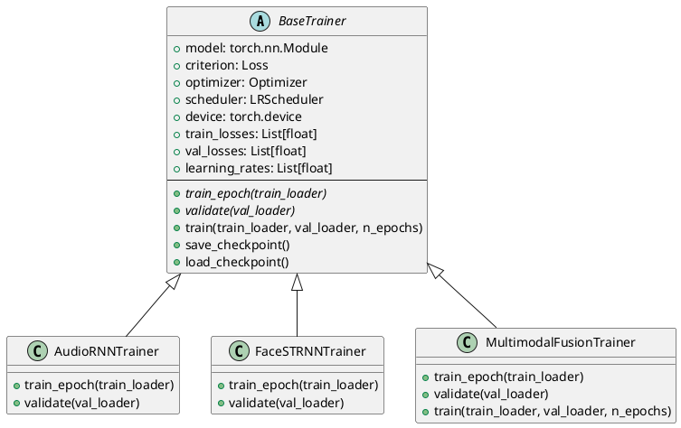

# Implementing Individual Modalities

## Introduction

The development of effective depression detection systems requires careful consideration to ensure an approah that best suit each type of data modality. This chapter presents the architectural, implementation and training details of the three distinct modalities in the dataset. These individual modality models will later serve as the foundation for a multimodal architecture that integrates text, audio, and facial analysis into a unified model, leveraging the complementary strengths of each modality to achieve higher detection accuracy.

## Model Architectures

The development of effective depression detection systems requires careful consideration of model architectures that best suit each type of data modality. This chapter presents the implementation details of three distinct modalities: textual analysis using TF-IDF with Random Forest classification, audio analysis using Recurrent Neural Networks (RNN), and facial expression analysis using Spatiotemporal Recurrent Neural Networks (STRNN).
Each modality presents unique challenges and opportunities in the context of depression detection textual data contains semantic meaning and linguistic patterns, audio captures prosodic and acoustic features of speech, while facial expressions reveal visual emotional cues through both spatial and temporal dimensions. The architectures selected for each modality have been specifically chosen to address these distinct characteristics, with careful consideration given to their theoretical foundations, structural components, and their ability to effectively model the complex patterns associated with depressive symptoms.

### Text Based Model

The textual analysis component employs a natural language processing pipeline that combines Term Frequency-Inverse Document Frequency (TF-IDF) vectorization with Random Forest classification. This approach was selected after careful consideration of the unique characteristics of conversational text data in mental health contexts, where both semantic meaning and word usage patterns play crucial roles in depression detection.

The TF-IDF vectorization process implements a weighting scheme that goes beyond simple word counting. The Term Frequency component captures the raw frequency of terms within each document while implementing sub-linear scaling to prevent bias towards longer documents. It employs a probabilistic framework for term importance estimation that effectively balances the significance of frequent versus rare terms. The Inverse Document Frequency component complements this by implementing a logarithmic scaling factor to reduce the weight of common terms, incorporating document frequency smoothing to handle rare terms, and applying normalization to ensure comparable feature scales.

The Random Forest classifier was chosen for its several advantageous properties in the context of depression detection. It provides interpretable measures of word and phrase contributions, enabling identification of key linguistic markers of depression and facilitating validation against clinical knowledge. Through ensemble learning, it reduces overfitting through bootstrap aggregation, handles high-dimensional sparse text features effectively, and maintains robustness against noise in conversational data. Furthermore, its ability to model non-linear relationships allows it to capture complex interactions between linguistic features, adapt to varying expression patterns across different subjects, and accommodate both explicit and implicit depression indicators.

### Audio Based Model

The audio analysis utilizes Recurrent Neural Networks with LSTM cells to capture temporal dependencies in speech patterns. This architecture is particularly well-suited for processing sequential data and analyzing acoustic features that evolve over time. This implementation uses a specialized variant of RNNs designed to handle the complex temporal patterns present in speech signals.

The audio model architecture consists of multiple recurrent layers with LSTM cells, allowing the network to learn long-term dependencies while avoiding the vanishing gradient problem common in traditional RNNs. The LSTM architecture provides significant benefits for audio processing: it effectively captures long-range dependencies in speech patterns, demonstrates robustness to varying input lengths, handles temporal features such as pitch, rhythm, and pause patterns effectively, and maintains gradient stability during training through gated memory cells.

An attention mechanism is incorporated into the architecture to enable the model to focus on the most relevant parts of the audio sequence. This is particularly important in depression detection, as certain segments of speech may carry more significant indicators of depressive symptoms than others. The attention weights are learned during training, allowing the model to automatically identify and emphasize these crucial segments.

### Facial Expression Model

The facial expression analysis leverages a Spatiotemporal Recurrent Neural Network (STRNN) that combines spatial and temporal attention mechanisms. This architecture enables both spatial feature extraction and temporal pattern recognition, making it particularly well-suited for analyzing facial expressions as it can capture both spatial relationships within individual frames and temporal patterns across frame sequences.

The STRNN architecture incorporates both spatial and temporal attention mechanisms to process facial expressions effectively. The spatial attention component allows the model to focus on relevant facial regions and features within each frame, while the temporal attention mechanism helps track and analyze changes in expressions over time. This dual attention approach is crucial for depression detection, as it enables the model to identify subtle changes in facial expressions that may indicate depressive symptoms.

The architecture employs bidirectional LSTM cells for temporal modeling, allowing it to process sequences in both forward and backward directions. This bidirectional approach ensures that the model can capture both past and future context when analyzing facial expressions, leading to more comprehensive feature extraction. The model also incorporates dropout and batch normalization techniques to prevent overfitting and ensure stable training.

This architecture provides several advantages for facial expression analysis in the context of depression detection. It effectively captures spatial relationships in facial features while modeling temporal changes in expressions over time. The integration of both local and global facial information, combined with robust feature learning through hierarchical processing, allows the model to detect subtle patterns that may be indicative of depressive states.

## Implementation Details

### Text Model Implementation

The text-based model implementation leverages scikit-learn's Pipeline architecture, integrating TF-IDF vectorization with Random Forest classification. The implementation's foundation lies in its text processing pipeline:

```python
text_model = Pipeline([
    ('tfidf', TfidfVectorizer(
        max_features=5000,
        ngram_range=(1, 2),
        sublinear_tf=True,
        min_df=5,
        max_df=0.75
    )),
    ('classifier', RandomForestClassifier(
        n_estimators=100,
        max_depth=None,
        min_samples_split=10,
        random_state=42
    ))
])
```

The TF-IDF vectorization component incorporates several critical optimizations designed to enhance the model's performance. By implementing sublinear term frequency scaling, the system effectively prevents common words from dominating the feature space. The careful selection of document frequency thresholds, with minimum document frequency set to 5 and maximum to 0.75, ensures optimal feature selection by filtering both rare terms that might introduce noise and ubiquitous terms that provide little discriminative value. This approach creates a refined feature space that particularly emphasizes depression-relevant terms.

The Random Forest classification component builds upon this optimized feature representation through a carefully tuned ensemble approach. The classifier employs an ensemble of 100 decision trees with bootstrap aggregation, striking a balance between model complexity and performance. The implementation deliberately avoids imposing maximum depth constraints while maintaining minimum split thresholds, allowing the model to capture complex patterns while preventing overfitting. This architecture proves particularly effective in handling the high-dimensional TF-IDF feature space, demonstrating robust performance across varying text inputs.

### Audio Model Implementation

The audio model implementation features an attention-enhanced LSTM architecture, carefully crafted to capture the temporal dynamics of speech patterns. The implementation, housed in models/audio_rnn.py, comprises several components working in concert:

```python
class AudioRNN(nn.Module):
    def __init__(self, input_size, hidden_size, num_layers, dropout):
        super(AudioRNN, self).__init__()
        self.hidden_size = hidden_size
        self.num_layers = num_layers

        # LSTM layer
        self.lstm = nn.LSTM(
            input_size=input_size,
            hidden_size=hidden_size,
            num_layers=num_layers,
            batch_first=True,
            dropout=dropout if num_layers > 1 else 0
        )

        # Attention mechanism
        self.attention = nn.Linear(hidden_size, 1)

        # Output layers
        self.fc1 = nn.Linear(hidden_size, 32)
        self.dropout = nn.Dropout(dropout)
        self.fc2 = nn.Linear(32, 2)  # 2 classes for binary classification

    def forward(self, x):
        # LSTM forward pass
        lstm_out, _ = self.lstm(x)

        # Apply attention
        attention_weights = torch.softmax(self.attention(lstm_out), dim=1)
        context_vector = torch.sum(attention_weights * lstm_out, dim=1)

        # Final classification layers
        out = self.dropout(torch.relu(self.fc1(context_vector)))
        out = self.fc2(out)
        return out
```

The LSTM processing layer forms the backbone of the audio analysis system, implementing a configurable sequence processing mechanism with variable depth. The architecture incorporates strategic dropout between layers, establishing robust regularization that preserves essential sequence information while preventing overfitting. This approach maintains sequence coherency throughout the processing pipeline, ensuring reliable feature extraction from speech patterns.

The attention mechanism represents a crucial in the model's architecture, implementing learned weights to identify and emphasize salient speech segments. Through softmax normalization, the system generates a probability distribution over temporal segments, enabling dynamic focus on speech patterns that may indicate depressive symptoms. This attention approach significantly enhances the model's ability to identify and analyze relevant acoustic features.

The classification pipeline culminates in a carefully structured sequence of transformations. Initially, the system reduces the feature space to 32 dimensions through non-linear transformation, followed by dropout implementation to prevent feature co-adaptation. The architecture maintains probabilistic interpretability through cross-entropy loss, ensuring meaningful probability distributions over depression classifications.

### Face Model Implementation

The facial expression analysis system implements a multi-stream architecture with integrated spatial and temporal attention mechanisms. The implementation, contained within models/face_strnn.py, represents a state-of-the-art approach to facial expression analysis:

```python
class SpatialAttention(nn.Module):
    def __init__(self, input_dim):
        super(SpatialAttention, self).__init__()
        self.attention = nn.Sequential(
            nn.Linear(input_dim, input_dim // 2),
            nn.ReLU(),
            nn.Linear(input_dim // 2, 1),
            nn.Sigmoid()
        )

    def forward(self, x):
        # x shape: (batch, seq_len, input_dim)
        attention_weights = self.attention(x)  # (batch, seq_len, 1)
        attended_features = x * attention_weights
        return attended_features, attention_weights

class TemporalAttention(nn.Module):
    def __init__(self, hidden_dim):
        super(TemporalAttention, self).__init__()
        self.attention = nn.Sequential(
            nn.Linear(hidden_dim, hidden_dim // 2),
            nn.Tanh(),
            nn.Linear(hidden_dim // 2, 1)
        )

    def forward(self, hidden_states):
        # hidden_states shape: (batch, seq_len, hidden_dim)
        attention_weights = self.attention(hidden_states)  # (batch, seq_len, 1)
        attention_weights = torch.softmax(attention_weights, dim=1)
        context = torch.sum(hidden_states * attention_weights, dim=1)  # (batch, hidden_dim)
        return context, attention_weights
```

```python
class FaceSTRNN(nn.Module):
    def __init__(self, input_size, hidden_size, num_layers, num_classes, dropout):
        super(FaceSTRNN, self).__init__()

        self.hidden_size = hidden_size
        self.num_layers = num_layers

        # Spatial attention
        self.spatial_attention = SpatialAttention(input_size)

        # Bidirectional LSTM
        self.lstm = nn.LSTM(
            input_size=input_size,
            hidden_size=hidden_size,
            num_layers=num_layers,
            batch_first=True,
            bidirectional=True,
            dropout=dropout if num_layers > 1 else 0
        )

        # Temporal attention
        self.temporal_attention = TemporalAttention(hidden_size * 2)  # *2 for bidirectional

        # Output layers
        self.fc1 = nn.Linear(hidden_size * 2, hidden_size)
        self.dropout = nn.Dropout(dropout)
        self.batch_norm = nn.BatchNorm1d(hidden_size)
        self.fc2 = nn.Linear(hidden_size, num_classes)

    def forward(self, x):
        # Apply spatial attention
        x, spatial_weights = self.spatial_attention(x)

        # LSTM forward pass
        lstm_out, _ = self.lstm(x)

        # Apply temporal attention
        context, temporal_weights = self.temporal_attention(lstm_out)

        # Final classification
        out = self.fc1(context)
        out = self.batch_norm(out)
        out = torch.relu(out)
        out = self.dropout(out)
        out = self.fc2(out)

        return out, spatial_weights, temporal_weights
```

The spatial attention module implements a two-layer neural network architecture with dimensional reduction capabilities. Through ReLU activation functions, the system captures spatial patterns within facial features. The implementation employs sigmoid-bounded weights, enabling focused analysis of specific facial regions that may indicate depressive symptoms.

The temporal attention module extends the system's capabilities through a sequence-aware mechanism designed to track the evolution of facial expressions over time. The implementation utilizes tanh activation for enhanced temporal gradient flow, coupled with softmax normalization for effective temporal importance filtering. This approach enables the system to identify and analyze subtle changes in expression patterns that may correlate with depressive states.

The main STRNN architecture integrates these components through a bidirectional LSTM implementation, enabling comprehensive processing of facial expression sequences. The system doubles hidden states to ensure complete information preservation throughout the processing pipeline. The classification head implements a structured approach with batch normalization and dropout, maintaining robust performance while preventing overfitting. Notably, the architecture returns both predictions and attention weights, providing valuable insights into the model's decision-making process—a critical feature for clinical applications where understanding the basis for depression detection is paramount.

## Training Pipeline

### Introduction

The implementation of effective training procedures is crucial for developing robust depression detection models across different modalities. This section presents a comprehensive training pipeline that addresses the unique challenges of training deep learning models for mental health applications. The pipeline implements training strategies that ensure model convergence while maintaining clinical relevance and preventing overfitting, which is particularly important given the sensitive nature of depression detection.

The training framework adopts a modular architecture that promotes code reusability while accommodating modality-specific requirements. This design enables consistent training procedures across different modalities while allowing for specialized optimizations and data handling routines. The implementation incorporates best practices in deep learning, including early stopping mechanisms, learning rate scheduling, and comprehensive performance monitoring.

### Architecture Overview

The training pipeline implements a hierarchical class structure much like the preprocessing pipeline, with the BaseTrainer class serving as the foundational abstract base class. This architectural decision enables the definition of a common interface while implementing shared functionality for model training, validation, and checkpointing procedures. The design pattern enables specialized trainers to implement modality-specific procedures while maintaining a consistent training framework across all implementations.



#### Base Trainer Architecture

The BaseTrainer class establishes the fundamental training infrastructure through a generic, broad usecase interface that encompasses essential training components. The architecture has been designed to address the complexities of deep learning model training, incorporating model management systems for initialization and state control, comprehensive training loop mechanisms for epoch-level control and validation integration, and optimization management for coordinating loss computation and parameter updates. Additionally, the architecture implements efficient resource utilization strategies, ensuring optimal GPU memory management and gradient accumulation procedures.

```python
class BaseTrainer(ABC):
    def __init__(self, model, criterion, optimizer, scheduler, device,
                 early_stopping_patience=7, checkpoint_dir="checkpoints"):
        # ...initialization code...
```

### Training Framework Implementation

#### Core Training Components

The training framework incorporates several components that work in concert to ensure robust and efficient model training. These components have been designed with careful consideration of the unique challenges presented by depression detection tasks and the requirements of different modalities.

##### Early Stopping and Checkpointing

The early stopping mechanism implements an approach to preventing overfitting through a patience-based system. This system conducts continuous monitoring of validation performance metrics and implements automatic training termination when performance plateaus, maintaining a persistent counter for patience monitoring with configurable parameters. The implementation allows for fine-grained control over the training process while ensuring optimal model performance.

The state preservation system implements comprehensive checkpointing functionality that maintains detailed records of the training state. This includes preservation of the model's state dictionary, optimizer state information for seamless training resumption, learning rate scheduler state, and complete historical records of training and validation metrics. This approach to state preservation ensures reproducibility and enables detailed analysis of the training process.

##### Device Management and Data Movement

The training infrastructure implements device management and data movement strategies that ensure optimal resource utilization:

```python
def train_epoch(self, train_loader):
    # Move data to appropriate device (CPU/GPU)
    batch_X, batch_y = batch_X.to(self.device), batch_y.to(self.device)
```

##### Learning Rate Management

Learning rate control is implemented through a integration with PyTorch's scheduler ecosystem. This integration provides comprehensive learning rate tracking across training epochs, implements dynamic adaptation based on validation metrics, maintains optimal convergence characteristics, and prevents learning stagnation through automated adjustment mechanisms.

##### Progress Monitoring

The framework implements extensive metrics tracking capabilities that provide detailed insights into the training process:

```python
def train_epoch(self, train_loader):
    self.model.train()
    total_loss = 0

    for batch in train_loader:
        self.optimizer.zero_grad()
        loss = self._process_batch(batch)
        loss.backward()

        # Gradient clipping for stability
        if hasattr(self, 'clip_grad'):
            torch.nn.utils.clip_grad_norm_(
                self.model.parameters(),
                self.clip_grad
            )

        self.optimizer.step()
        total_loss += loss.item()

    return total_loss / len(train_loader)
```

#### Advanced Training Features

The training pipeline incorporates several features that ensure robust model training. Gradient clipping is implemented using L2 norm-based approaches with configurable thresholds, providing essential stability during the training process. Real-time progress visualization capabilities have been integrated to provide immediate feedback on training progression, while comprehensive state preservation mechanisms ensure no training progress is lost.

The implementation includes dimension standardization techniques for multimodal fusion, utilizing projection layers to ensure consistent dimensional representation across different modalities:

```python
# Projection layers to standardize dimensions
self.text_projection = nn.Linear(self.text_output_size, 256)
self.audio_projection = nn.Linear(self.audio_output_size, 256)
self.face_projection = nn.Linear(self.face_output_size, 256)
```

### Modality-Specific Implementations

The framework implements specialized training procedures for each modality while maintaining the consistent interface defined by the BaseTrainer class. Each implementation addresses the unique characteristics and requirements of its respective modality.

#### Text Model Training

The text modality implementation incorporates specialized text processing capabilities:

```python
class TextTrainer(Trainer):
    def _process_batch(self, batch):
        texts, labels = batch
        features = self.model.vectorizer.transform(texts)
        predictions = self.model.classifier.predict_proba(features)
        return self.criterion(predictions, labels)
```

#### Audio Model Training

The audio modality implementation addresses the temporal nature of audio data through specialized recurrent neural network architectures:

```python
class AudioRNNTrainer(BaseTrainer):
    def train_epoch(self, train_loader):
        self.model.train()
        train_loss = 0

        for batch_X, batch_y in progress_bar:
            batch_X, batch_y = batch_X.to(self.device), batch_y.to(self.device)
            output = self.model(batch_X)
            loss = self.criterion(output, batch_y)
            loss.backward()
            torch.nn.utils.clip_grad_norm_(self.model.parameters(), max_norm=1.0)
```

#### Face Model Training

The facial analysis implementation incorporates spatio-temporal processing capabilities:

```python
class FaceSTRNNTrainer(BaseTrainer):
    def train_epoch(self, train_loader):
        # Specialized handling of spatial-temporal data
        output, spatial_weights, temporal_weights = self.model(batch_X)
```

### Model Persistence and Deployment

The framework implements model persistence strategies that are tailored to the specific requirements of each modality. The serialization approaches have been carefully designed to preserve all necessary information for model deployment and subsequent training continuation:

```python
# Text model
joblib.dump(text_model, 'models/text_model.joblib')

# Audio and Face models
torch.save({
    'model_state_dict': model.state_dict(),
    'optimizer_state_dict': optimizer.state_dict(),
    'training_config': training_config
}, f'models/{modality}_model.pth')
```

The implementation supports training resumption capabilities through a robust checkpoint loading system:

```python
def train(self, train_loader, val_loader, n_epochs, resume_from=None):
    start_epoch = 0
    if resume_from:
        start_epoch = self.load_checkpoint(resume_from)
```

This comprehensive implementation represents a approach to model training across different modalities while maintaining flexibility for modality-specific optimizations. The architecture's modularity facilitates seamless extension to new modalities while ensuring consistent training practices and comprehensive performance monitoring across all implementations.
