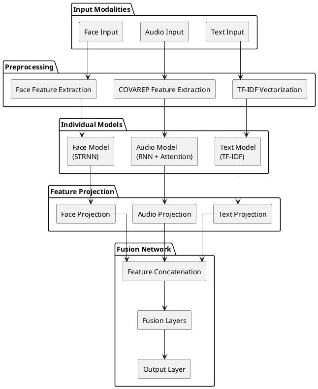

# Implementing Multimodal Fusion

## Introduction

Multimodal fusion represents an approach to combining information from multiple data sources to achieve more robust and accurate predictions. In the context of depression detection, this approach is particularly valuable as it allows the system to leverage complementary information from textual, audio, and facial expression modalities. This chapter presents the theoretical foundations of multimodal fusion and details its implementation in the depression detection system, including the necessary preprocessing steps, model architecture, and training pipeline.

## On multimodal fusion

### Overview of Multimodal Fusion

Multimodal fusion represents an approach to information integration, combining data from multiple modalities to achieve predictions that surpass the capabilities of single-modality systems. In the context of depression detection, this approach is particularly valuable as it enables the system to analyze various manifestations of the condition across verbal, vocal, and visual domains. The integration of these complementary information sources can occur at different levels of processing, each with its own theoretical foundations and practical implications.

The first approach, early fusion, also known as feature-level fusion, involves the direct combination of raw features from different modalities before any significant processing occurs. This method offers the advantage of simplicity in architectural design and can potentially capture low-level interactions between modalities at their most primitive form. Additionally, the computational requirements during training are generally lower compared to other fusion approaches. However, early fusion faces significant challenges when dealing with temporal data streams of varying sampling rates, as is common in multimodal depression detection. The method also struggles to leverage modality-specific processing techniques and may lose important temporal characteristics inherent to each modality. Furthermore, the handling of missing modalities becomes particularly challenging, as the fusion occurs before any meaningful feature extraction.

Late fusion, alternatively referred to as decision-level fusion, takes an opposing approach by maintaining separate processing pipelines for each modality until the final decision-making stage. This method offers several advantages, including a highly modular architecture that facilitates independent processing of each modality and straightforward handling of missing data. It allows for the implementation of specialized models optimized for each modality's unique characteristics. However, late fusion often fails to capture important cross-modal interactions that could provide valuable diagnostic insights. The approach also incurs higher computational costs during inference, as multiple models must be maintained and executed in parallel. Perhaps most significantly, the potential loss of complementary information between modalities can limit the system's ability to detect subtle patterns that emerge from the interaction of different depression indicators.

The third approach, intermediate or hybrid fusion, represents a carefully balanced compromise between the previous two methods. This technique combines features at intermediate levels of processing, after modality-specific preprocessing but before final decision-making. The hybrid approach preserves the ability to apply specialized processing to each modality while enabling the learning of cross-modal patterns through carefully designed fusion layers. While this method introduces additional architectural complexity and requires more careful consideration of hyperparameter tuning, its flexibility and potential for capturing complex cross-modal interactions make it particularly suitable for depression detection.

In the implementation, an intermediate fusion approach has been adopted, guided by several critical considerations derived from the nature of the data and the specific requirements of depression detection. The temporal characteristics of the data streams present a fundamental challenge: audio data requires high sampling rates (100Hz after resampling), facial features combine multiple components captured at 30fps, and textual data exists in a non-temporal format. These varying temporal scales would make early fusion particularly problematic, while late fusion would fail to capture the temporal relationships between modalities that often provide crucial diagnostic information.

The complexity of the feature space further justifies the hybrid approach. Audio features encompass a rich set of COVAREP features, including fundamental frequency, formants, and spectral characteristics. Facial features combine spatial data from multiple sources, including HOG features, three-dimensional facial landmarks, and Action Units. Textual data, processed through TF-IDF vectorization, exists in yet another dimensional space. Each of these modalities requires specialized preprocessing and feature extraction techniques that would be lost in an early fusion approach.

The hybrid fusion implementation utilises specialized processing for each modality while enabling meaningful cross-modal learning. Face data is processed through a spatial-temporal attention network (STRNN), audio features are analyzed using RNN with attention mechanisms, and text undergoes TF-IDF transformation. These specialized processes feed into a fusion network that projects features into a common dimensional space before combining them through learned layers. This architecture allows the model to handle cases where modalities provide complementary or even contradictory information, a common occurrence in depression detection where symptoms may manifest differently across modalities.

## Architecture Diagram

The architectural design of the multimodal fusion system is structured as a hierarchical pipeline that systematically processes and integrates information from three distinct modalities: textual, audio, and facial data. The architecture follows a modular design philosophy, where each modality undergoes specialized preprocessing and feature extraction before being integrated into a unified representation space. This design enables the system to leverage the unique characteristics of each modality while facilitating effective cross-modal learning.

The architecture begins with the input layer, which receives raw data from three distinct sources: textual transcripts, audio recordings, and facial video streams. Each input stream is directed to its specialized preprocessing module, where domain-specific feature extraction techniques are applied. The textual data undergoes TF-IDF vectorization to capture semantic content, while audio data is processed through COVAREP feature extraction to obtain acoustic characteristics. Facial data is processed through a dedicated feature extraction pipeline that captures both spatial and temporal aspects of facial expressions.

Following preprocessing, each modality is processed by its dedicated model architecture. The text model employs TF-IDF-based processing, the audio model utilizes a recurrent neural network with attention mechanisms, and the facial model implements a spatial-temporal recurrent neural network (STRNN). These specialized models are designed to capture the unique patterns and characteristics inherent to each modality.

A critical component of the architecture is the feature projection layer, which standardizes the dimensionality of features from each modality to a common space. This standardization is essential for enabling effective feature fusion while preserving the discriminative power of each modality. The projected features are then concatenated and passed through a series of fusion layers, which learn to combine the complementary information from different modalities.

The final stage of the architecture consists of the fusion network, which integrates the standardized features through a series of fully connected layers. This network employs a hierarchical structure that progressively combines features through concatenation, followed by multiple fusion layers that learn complex cross-modal interactions. The architecture culminates in an output layer that produces the final depression detection prediction.

The following diagram illustrates the complete architecture of the multimodal fusion approach for depression detection:



### Challenges in Multimodal Fusion

The implementation of multimodal fusion presents several significant challenges that must be carefully addressed to ensure effective integration of heterogeneous data sources. One of the primary challenges lies in the temporal alignment of different modalities, as each data stream often exhibits distinct sampling rates and temporal characteristics. This temporal misalignment can significantly impact the system's ability to capture meaningful cross-modal interactions and correlations.

The heterogeneous nature of multimodal data introduces another layer of complexity through varying feature dimensionalities across modalities. Each modality typically produces features with distinct characteristics and dimensions, necessitating complex dimensionality reduction and standardization techniques to enable effective feature fusion. This challenge is particularly pronounced in depression detection, where the feature spaces of audio, visual, and textual data differ substantially in both their structure and semantic meaning.

Finaly most importantly, the system must address the challenge of modality importance, as different modalities may contribute differently to the final prediction. This challenge is particularly relevant in depression detection, where certain modalities may be more informative for specific aspects of the condition. The system must learn to appropriately weight and combine information from each modality, potentially adapting these weights based on the specific context or characteristics of the input data.

## Implementing multimodal fusion

### Setup for Multimodal Fusion

The implementation of multimodal fusion necessitates a comprehensive setup process that addresses several fundamental challenges inherent in combining heterogeneous data sources. This section presents an approach to preparing and integrating data from multiple modalities, with each component serving a specific purpose in enabling effective fusion. The setup process is divided into two main components: data preparation and model preparation.

#### Data Preparation for Multimodal Fusion

The first component of the setup process focuses on preparing the raw data from each modality for fusion. This involves several critical steps that ensure the data is properly aligned, processed, and standardized before being fed into the fusion model.

##### Temporal Alignment Implementation

The first critical challenge in multimodal fusion arises from the inherent temporal misalignment between different data modalities. In this implementation, the temporal characteristics of each modality differ significantly: audio data is sampled at high frequencies and resampled to 100Hz for COVAREP feature extraction, facial features are captured at 30 frames per second (approximately 33.33ms intervals), and textual data exists in a non-temporal format. This temporal disparity necessitates a complex alignment strategy to ensure meaningful cross-modal interactions.

The temporal alignment methodology developed for this purpose employs a systematic two-stage approach. The process initiates with the conversion of all temporal data to a standardized timestamp format, followed by a hierarchical resampling strategy. The first stage involves resampling audio data to match the video frame rate, ensuring synchronization with facial features. The second stage implements further downsampling to a common rate, complemented by a rolling window application to maintain temporal coherence while reducing noise. This approach is implemented through the following methodology:

```python
def _process_temporal_features(self, df, timestamp_col, ds_freq, rw_size):
    # Convert to consistent timestamp format
    df["TIMESTAMP"] = pd.to_timedelta(df[timestamp_col], unit="s")
    df.set_index(["ID", "TIMESTAMP"], inplace=True)

    # Resample audio data to match video frame rate
    if "AUDIO" in timestamp_col:
        df = df.groupby("ID").resample("33.3311ms", level="TIMESTAMP").mean()

    # Further downsample to common rate and apply rolling window
    df_resampled = df.groupby("ID").resample(ds_freq, level="TIMESTAMP").mean()
    return df_resampled.groupby(level="ID")\
        .rolling(rw_size, on=df_resampled.index.get_level_values("TIMESTAMP"))\
        .mean()
```

##### Feature Dimensionality Reduction Strategy

Following temporal alignment, the second major challenge emerges from the heterogeneous nature of the multimodal data. Each modality produces features with distinct characteristics and dimensions: audio data encompasses COVAREP features including fundamental frequency, formants, and various spectral characteristics; facial data combines multiple feature types including gaze patterns, Action Units (AUs), Histogram of Oriented Gradients (HOG), pose estimation, and three-dimensional landmarks; while textual data is represented through TF-IDF vectors. This high-dimensional feature space necessitates an effective dimensionality reduction strategy.

To address this challenge, Principal Component Analysis (PCA) is employed as a dimensionality reduction technique. This approach serves multiple purposes: it reduces computational complexity, mitigates the curse of dimensionality, and preserves the most informative aspects of each modality. The implementation of this feature processing pipeline is demonstrated through the following methodology:

```python
def process_features():
    # Apply PCA to audio features
    audio_features = df_audio.select_dtypes(include=['float64', 'int64'])
    audio_pca, audio_pca_info = load_and_transform_pca(
        audio_features.values,
        'models/pca_audio.pkl'
    )

    # Apply PCA to facial features
    face_features = df_face.select_dtypes(include=['float64', 'int64'])
    face_pca, face_pca_info = load_and_transform_pca(
        face_features.values,
        'models/pca_face.pkl'
    )
```

##### Integrated Data Pipeline Architecture

The final component of the data preparation process integrates all previous components into a cohesive data pipeline. This pipeline orchestrates the complex interplay between different components of the system, implementing a systematic approach to data processing. The pipeline encompasses the loading of preprocessed features from each modality, application of temporal alignment and resampling strategies, execution of dimensionality reduction through PCA, and the organization of data into appropriate batches for model training.

The implementation of this integrated pipeline is demonstrated through the following methodology:

```python
def prepare_fusion_data(percentage=1.0):
    # Load data from each modality
    df_text = text_loader.get_data(percentage=percentage)
    df_audio = audio_loader.get_data(
        percentage=percentage,
        ds_freq="10s",  # Downsample frequency
        rw_size="10s"   # Rolling window size
    )
    df_face = face_loader.get_data(
        percentage=percentage,
        ds_freq="10s",
        rw_size="10s"
    )

    # Ensure temporal alignment
    df_audio = df_audio.reset_index()
    df_face = df_face.reset_index()

    return df_text, df_audio, df_face
```

#### Model Preparation for Multimodal Fusion

The second component of the setup process focuses on preparing the individual models and their associated components for fusion. This involves loading and configuring the pretrained models, standardizing their output spaces, and preparing them for integration into the fusion framework.

##### Individual Model Loading and Configuration

The foundation of the fusion process rests upon the individual models trained for each modality. These models are loaded and configured to ensure they are in the correct state for fusion. The implementation employs three distinct models: a text model utilizing TF-IDF vectorization, an audio model employing an RNN with attention mechanism, and a facial model implementing a Spatial-Temporal Recurrent Neural Network (STRNN).

The loading and configuration of these models is implemented through the following methodology:

```python
def load_models():
    # Load text model
    text_model = joblib.load('text_model.joblib')

    # Load audio and face models
    audio_model, audio_scaler = train.load_model(AudioRNN, "audio_model.pth", DEVICE)
    face_model, face_scaler = train.load_model(FaceSTRNN, "face_model.pth", DEVICE)

    return text_model, audio_model, face_model, audio_scaler, face_scaler
```

##### Feature Space Standardization Methodology

A critical component of the model preparation process is the standardization of feature spaces across modalities. To enable effective fusion, features from each modality must be projected into a common dimensional space while preserving their discriminative power. This standardization process involves projecting text features from their TF-IDF dimension, audio features from their RNN output dimension (2 _ hidden_size), and facial features from their STRNN output dimension (2 _ hidden_size) into a standardized space.

The implementation of this standardization is achieved through carefully designed projection layers within the fusion model:

```python
# Projection layers
self.text_projection = nn.Linear(self.text_output_size, 256)
self.audio_projection = nn.Linear(self.audio_output_size, 256)
self.face_projection = nn.Linear(self.face_output_size, 256)
```

This setup process establishes a robust foundation for multimodal fusion, addressing the key challenges of temporal alignment, feature dimensionality, and model integration while maintaining the integrity and information content of each modality. The careful consideration given to each component of the setup process ensures the optimal performance of the subsequent fusion operations.

### Model Structure

The multimodal fusion architecture is implemented as a PyTorch neural network module that orchestrates the integration of three specialized models, each designed to process a distinct modality. The implementation follows the intermediate fusion paradigm, where modality-specific processing is preserved while enabling cross-modal learning through carefully designed fusion layers. The architecture is encapsulated in the MultimodalFusion class, which inherits from PyTorch's nn.Module base class, following the established pattern for neural network implementations in the PyTorch ecosystem.

```python
class MultimodalFusion(nn.Module):
    def __init__(self, text_model, audio_model, face_model):
        super(MultimodalFusion, self).__init__()
        self.text_model = text_model
        self.audio_model = audio_model
        self.face_model = face_model

        # Freeze individual models
        for model in [self.audio_model, self.face_model]:
            for param in model.parameters():
                param.requires_grad = False

        # Get output sizes from each model
        self.text_output_size = len(self.text_model.named_steps['tfidf'].get_feature_names_out())
        self.audio_output_size = self.audio_model.hidden_size * 2  # *2 for bidirectional
        self.face_output_size = self.face_model.hidden_size * 2  # *2 for bidirectional

        # Projection layers to standardize dimensions
        self.text_projection = nn.Linear(self.text_output_size, 256)
        self.audio_projection = nn.Linear(self.audio_output_size, 256)
        self.face_projection = nn.Linear(self.face_output_size, 256)

        # Fusion layers
        self.fusion_layers = nn.Sequential(
            nn.Linear(256 * 3, 512),
            nn.ReLU(),
            nn.Dropout(0.3),
            nn.Linear(512, 128),
            nn.ReLU(),
            nn.Dropout(0.3),
            nn.Linear(128, 2)
        )
```

The constructor accepts three pretrained models as input parameters, establishing a modular and extensible architecture that allows for independent development and optimization of each modality-specific model. This design choice enables the incorporation of specialised models for each modality while maintaining a clean separation of concerns.

The implementation freezes the parameters of the audio and facial models while keeping the text model trainable. This design choice is motivated by the observation that the audio and facial models, being more complex and having been pretrained on large datasets, benefit from parameter stability during fusion training. The text model, being simpler and more adaptable, is allowed to fine-tune during the fusion process.

The dimensionality standardization process employs a projection strategy. Each modality's output is projected into a common space through dedicated linear layers. This standardization is crucial for enabling effective feature fusion while preserving the each modality. The projection layers are implemented using PyTorch's nn.Linear module, which provides efficient matrix multiplication and bias addition operations.

The fusion network architecture implements a hierarchical structure through a sequence of fully connected layers, each followed by non-linear activation functions and dropout layers for regularization. The architecture begins with a concatenation of the projected features, resulting in a vector. This concatenated representation is then processed through a series of transformations that progressively reduce dimensionality while learning complex cross-modal interactions. The implementation employs ReLU activation functions for introducing non-linearity and dropout layers with a rate of 0.3 for preventing overfitting.

### Feature Alignment and Fusion

The forward pass of the model implements a pipeline for feature extraction, alignment, and fusion. The implementation handles the heterogeneous nature of the input modalities through specialized processing paths for each modality. The text processing path employs a transformation pipeline that converts sparse TF-IDF representations into dense tensors, ensuring compatibility with the neural network architecture. The audio and facial processing paths leverage the attention mechanisms inherent in their respective models to extract temporally relevant features.

```python
def forward(self, text_input, audio_input, face_input):
    # Get embeddings from individual models
    # For text, convert sparse matrix to dense tensor
    text_output = torch.from_numpy(
        self.text_model.transform(text_input).toarray()
    ).float().to(text_input.device)
    text_output = self.text_projection(text_output)

    # For audio and face, get the outputs and discard attention weights
    audio_output, _, _ = self.audio_model(audio_input)
    audio_output = self.audio_projection(audio_output)

    face_output, _, _ = self.face_model(face_input)
    face_output = self.face_projection(face_output)

    # Concatenate embeddings
    combined = torch.cat((text_output, audio_output, face_output), dim=1)

    # Pass through fusion layers
    output = self.fusion_layers(combined)
    return output
```

The feature fusion process is implemented through a systematic sequence of operations. First, the modality-specific features are projected into the common dimensional space. This projection is followed by a concatenation operation that preserves the spatial relationships between features while enabling cross-modal learning. The concatenated features are then processed through the fusion network, which learns to combine the complementary information from different modalities through a series of non-linear transformations.

### Training Pipeline

The training pipeline is implemented through a class hierarchy that follows the Template Method design pattern. The MultimodalFusionTrainer class extends the abstract BaseTrainer class, inheriting common training functionality while implementing modality-specific training procedures. This design pattern promotes code reuse and maintains a consistent training interface across different model architectures.

```python
class MultimodalFusionTrainer(BaseTrainer):
    def __init__(
        self, model, criterion, optimizer, scheduler, device, early_stopping_patience=7
    ):
        super().__init__(model, criterion, optimizer, scheduler, device)
        self.early_stopping_patience = early_stopping_patience
        self.best_val_loss = float("inf")
        self.early_stopping_counter = 0

    def train_epoch(self, train_loader):
        self.model.train()
        total_train_loss = 0
        progress_bar = tqdm(train_loader, desc="Training")

        for batch_text, batch_audio, batch_face, batch_y in progress_bar:
            # Move all inputs to device
            batch_text = batch_text.to(self.device)
            batch_audio = batch_audio.to(self.device)
            batch_face = batch_face.to(self.device)
            batch_y = batch_y.to(self.device)

            self.optimizer.zero_grad()
            outputs = self.model(batch_text, batch_audio, batch_face)
            loss = self.criterion(outputs, batch_y)
            loss.backward()

            # Gradient clipping
            torch.nn.utils.clip_grad_norm_(self.model.parameters(), max_norm=1.0)

            self.optimizer.step()
            total_train_loss += loss.item()

            # Update progress bar
            progress_bar.set_postfix({"loss": f"{loss.item():.4f}"})

        return total_train_loss / len(train_loader)
```

The training process implements several advanced techniques for ensuring stable and effective model training. Gradient clipping is employed to prevent exploding gradients, with a maximum norm of 1.0. This technique is particularly important in multimodal fusion, where the combination of different feature spaces can lead to unstable gradients. The implementation uses PyTorch's nn.utils.clip grad_norm() function, which efficiently computes and clips gradients while preserving their relative magnitudes.

The training loop implements a comprehensive monitoring and optimization strategy. Each training iteration is wrapped in a progress bar using the tqdm library, providing real-time feedback on training progress and loss values. The implementation maintains separate tracking of training and validation losses, enabling the detection of overfitting and the implementation of early stopping.

```python
def train(self, train_loader, val_loader, n_epochs):
    train_losses = []
    val_losses = []

    for epoch in range(n_epochs):
        # Training
        train_loss = self.train_epoch(train_loader)
        train_losses.append(train_loss)

        # Validation
        val_loss = self.validate(val_loader)
        val_losses.append(val_loss)

        # Update learning rate
        self.scheduler.step(val_loss)

        # Early stopping check
        if val_loss < self.best_val_loss:
            self.best_val_loss = val_loss
            self.early_stopping_counter = 0
            torch.save(
                {
                    "model_state_dict": self.model.state_dict(),
                    "optimizer_state_dict": self.optimizer.state_dict(),
                    "train_loss": train_loss,
                    "val_loss": val_loss,
                    "epoch": epoch,
                },
                "best_multimodal_model.pth",
            )
        else:
            self.early_stopping_counter += 1
```

The early stopping mechanism is implemented through a patience-based approach, where training is terminated if the validation loss fails to improve for a specified number of epochs. This implementation helps prevent overfitting while ensuring that the model converges to an optimal solution. The best model state is preserved through a checkpointing system that saves the model's state dictionary, optimizer state, and training metrics.

The learning rate scheduling is implemented through a dynamic adjustment strategy based on validation loss. The scheduler reduces the learning rate when the validation loss plateaus, enabling fine-grained optimization in the later stages of training. This approach helps the model converge to better local optima while preventing premature convergence.

The hyperparameter optimization process employs a systematic grid search approach, exploring combinations of learning rates, weight decay values, and dropout rates. This exhaustive search ensures that the model's architecture is optimized for the specific characteristics of the multimodal depression detection task. The implementation uses a structured parameter grid that balances exploration of the hyperparameter space with computational efficiency.

```python
PARAM_GRID = {
    'learning_rate': [0.001, 0.0001],
    'weight_decay': [0.01, 0.001],
    'dropout': [0.2, 0.3]
}
```
